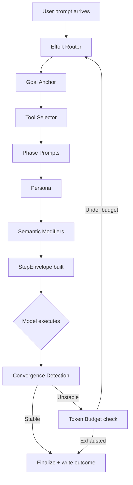

# Architecture

Agent Amplifier is an **execution-quality amplifier**, not a memory provider
and not a model wrapper. It sits inside the agent host's execution loop and
shapes every turn as it happens.

---

## Design principles

1. **Runtime, not offline.** Amplification happens while the agent runs, not
   in a separate evaluation pass or retraining step.
2. **Deterministic Python.** The kernel is pure computation. No LLM calls, no
   network I/O. Sub-100ms latency on commodity hardware.
3. **Fail-open.** If the amplifier crashes, your agent runs as if it is not
   installed. Zero blast radius.
4. **Pluggable memory.** Memory is an input to the pipeline. The kernel does
   not care whether the source is SuperLocalMemory, a CLAUDE.md file, or a
   LangGraph checkpointer. Adapters surface host memory; the kernel consumes
   it.
5. **ABC over Protocol.** We own every adapter. Loud failure on missing
   methods is the right tradeoff over silent duck-typing.

## Kernel pipeline

Every turn passes through the kernel in this order:



### Step-by-step

1. **Effort Router** (`effort_router.py`) -- classifies the prompt into one of
   five tiers: minimal, low, medium, high, max. Selects the thinking-budget
   trigger keyword (`think`, `think hard`, `megathink`, `ultrathink`). No
   configuration required; the classifier reads prompt structure, length, and
   keywords.

2. **Goal Anchor** (`goal_anchor.py`) -- captures the original user request
   and re-injects it every N tool calls (default 5). Prevents the model from
   drifting to sub-tasks after long execution chains. Tracks drift level
   per turn.

3. **Tool Selector** (`tool_selector.py`) -- reads the prompt and
   keyword-matches against tool descriptions. Surfaces the 10-20% most likely
   to be relevant; hides the rest for the turn. Based on the Vercel finding
   that dropping 80% of tools per turn produces the best quality gain.

4. **Phase Prompts** (`phase_prompts.py`) -- injects a different system-prompt
   header per iteration depth:
    - Iteration 0: **EXPLORE** -- cast a wide net, consider alternatives
    - Middle iterations: **EXPLOIT** -- commit, build, test
    - Final iteration: **FINALIZE** -- verify, polish, ship

5. **Persona** (`personas.py`) -- escalates the audit reviewer per iteration.
   Iteration 0 is "senior engineer, well-rested." Iteration 3 is "the same
   engineer at hour 12, hostile, looking for what is wrong."

6. **Semantic Modifiers** (`semantic_modifiers.py`) -- selects from a library
   of 97 validated keywords (`L99`, `CRIT`, `OODA`, `FINISH`, `AUDIT`,
   `WORSTCASE`, etc.) based on task type, phase, and persona. These keywords
   are A/B-tested triggers that reliably shift model reasoning patterns.

7. **Convergence Detection** (`convergence.py`) -- watches output across
   iterations and stops the loop when output has stabilized. Uses LTI
   (Linear-Time-Invariant) stability bounds for a mathematical termination
   guarantee. Default hard cap: 4 iterations.

8. **Token Budget** (`token_budget.py`) -- tracks cumulative token spend per
   turn with prefix-delta accounting. When the ceiling approaches, the kernel
   triggers a graceful finalize. Budget modes: `strict` (hard stop), `soft`
   (warn + continue), `off` (no enforcement).

## The StepEnvelope

The kernel's output is a `StepEnvelope` dataclass -- a frozen, immutable
snapshot of all amplification decisions for a single turn:

```python
@dataclass(frozen=True, slots=True)
class StepEnvelope:
    step_id: str
    effort_tier: str           # minimal / low / medium / high / max
    thinking_trigger: str      # e.g. "ultrathink"
    phase: str                 # EXPLORE / EXPLOIT / FINALIZE
    persona: str               # escalating reviewer description
    modifiers: tuple[str, ...] # e.g. ("L99", "CRIT", "FINISH")
    goal_anchor: str           # original user request
    recalled_context: str      # memory chunks (from SLM or host files)
    tool_shortlist: tuple[str, ...]
    iteration: int
    budget_remaining: int
```

The adapter translates this envelope into the host's injection format
(e.g., `additionalContext` for Claude Code hooks, `.cursor/rules/*.mdc` for
Cursor).

## Lifecycle hooks (Claude Code)

The Claude Code adapter installs five hooks:

| Hook | When it fires | What amp does |
|---|---|---|
| `UserPromptSubmit` | User sends a prompt | Full pipeline: classify, anchor, select, phase, persona, modifiers. Returns `StepEnvelope` as `additionalContext`. |
| `PreToolUse` | Before each tool call | Goal re-injection at N-call intervals. Tool-selector gating. |
| `PostToolUse` | After each tool call | Update convergence state. Track tool usage for budget accounting. |
| `Stop` | Agent finishes | Write outcome to memory. Log telemetry to `state.db`. |
| `PreCompact` | Context compaction starts | Observe-only in v1.0 (paper-data on compaction overlap). Active deferral in v1.0.1. |

## Threading model

The kernel uses an `anyio.Lock` for serialization. The lock is held **only**
around regions that mutate internal state. It is **never** held across:

- Memory provider I/O (recall/remember callbacks)
- Sub-module pure computation
- Building return dictionaries
- User-supplied callbacks (observability hooks)

This means memory providers and adapters can safely perform I/O without
blocking the kernel's critical section.

## State storage

All telemetry lives at `~/.claude/agent-amp/state.db` (SQLite). The database
stores:

- Per-turn envelopes (what amp decided)
- Per-turn outcomes (converged? drift? tools used? duration?)
- Session metadata

The `agent-amp report` command reads this database. The `agent-amp dashboard`
command serves a local web UI over it.

No data leaves your machine. No telemetry is sent anywhere.

## Cache-boundary optimization

The rendered prompt is ordered for maximum prompt-cache hit rate:

1. `<system-reminder>` block (modifiers + persona) -- **stable** per phase
2. `PHASE: <name>` + slot-resolved phase prompt -- **stable** per phase
3. Goal-anchored user query -- **dynamic**

Steps 1 and 2 are stable per `(effort, phase, persona)` tuple, giving
prompt caches the largest possible hit window before the dynamic content.
