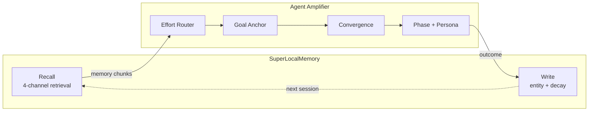

# SLM Composition

**Agent Amplifier** owns execution quality: how hard the agent thinks, what
goal to anchor against, when to stop iterating.
**SuperLocalMemory (SLM)** owns memory: what context the agent sees at turn
start, what facts to remember at turn end.

They never compete because they answer different questions. They always
compose because amp's Feature 9 (Cross-Host Memory Plane) treats memory as a
pluggable input. Together they form a full AI Reliability Engineering stack
for coding agents: reliable memory plus reliable execution.



---

## Three modes of composition

All three modes are live at v1.0. They layer automatically based on what you
have installed.

### Mode 1 -- Adjacent injection

Both products install their own hooks. Each runs its own `UserPromptSubmit`
handler. The host merges all injections into the prompt.

```
<system-reminder>
[SLM auto-context -- query-aware recall, ~69ms]
... your top 10 relevant memories ...
</system-reminder>
<system-reminder>
[Agent Amplifier -- turn 5, complexity=high, domain=performance]
PHASE: EXPLOIT. Classification: high/performance. Persona: senior engineer.
Modifiers: L99, CRIT, OODA, FINISH.
Goal anchor: <your original prompt>
</system-reminder>
```

Both products execute independently. Neither knows the other exists.

**When this is enough:** if you want both tools loaded with zero
configuration. This is the default after `slm install` + `agent-amp install
claude-code`.

**Cost:** zero. No shared state. No coordination overhead.

### Mode 2 -- Composed pipeline

Amp's `SLMAdapter` detects SLM is installed and calls `slm session-context`
whenever amp needs memory recall. The recall shapes downstream decisions:

- **Effort Router** sees prior task patterns, classifies more accurately
- **Goal Anchor** anchors against project intent, not just literal prompt text
- **Convergence Detection** compares output to past converged outputs
- **Phase Prompts** know which phase past similar tasks ended in

SLM's 4-channel retrieval (semantic + entity + temporal +
spreading-activation) gives amp dramatically richer signal than file-based
recall.

**Mode 2 is on by default when both are installed.** No configuration.

**Cost:** ~70 ms additional latency (overlaps with amp's other before-step
work, usually absorbed).

### Mode 3 -- Closed loop

Amp's Stop hook writes the turn outcome (converged? tools used? duration?
drift?) to SLM via `slm remember`. SLM ingests the outcome using its full
intelligent indexing -- atomic fact extraction, entity resolution, graph
edges, decay scheduling.

Tomorrow's amplification inherits today's outcomes:

- Tasks that converged inform future effort routing
- Tasks that were abandoned are flagged so amp's drift-anchor knows what not
  to repeat
- Per-project patterns surface in SLM's dashboard

**Mode 3 is on by default when both are installed.**

**Cost:** ~50 ms at Stop (fire-and-forget on a background queue).

---

## What you get without SLM

If SLM is not installed, amp falls back to **host-native memory files**:

| Host | Fallback memory source |
|---|---|
| Claude Code | `~/.claude/CLAUDE.md`, project `CLAUDE.md` and `MEMORY.md` |
| Cursor | `.cursor/rules/*.mdc`, legacy `.cursorrules` |
| GitHub Copilot | `.github/copilot-instructions.md` |
| LangGraph | Whatever `BaseCheckpointSaver` you configured |
| CrewAI | Whatever `Crew.memory` you configured |
| AgentScope | The framework's `Memory` instance |
| LangChain | Whatever `BaseMemory` you configured |

You still get Feature 9 active. Every user gets memory recall regardless of
memory product. The difference: lexical match versus SLM's 4-channel
retrieval.

**Closed-loop write fallback:** without SLM, amp appends a single
`## Amplifier note` block to a project-local `./MEMORY.md` at Stop. It never
modifies your `CLAUDE.md`.

---

## A worked example

Prompt: *"Refactor the payment service to use the new event-driven
architecture we discussed last week."*

### Without memory (amp alone)

- Complexity: `high` (refactor keyword + architecture reference)
- Domain: `general` (no specific tech signal)
- Memory recall: empty
- The model has to rediscover what "the new event-driven architecture" means.

### With host-native CLAUDE.md

- Complexity: `high`
- Memory: relevant CLAUDE.md lines about the Sprint 12 architecture decision
- The model starts with context. Better than nothing.

### With SLM (Mode 2 + Mode 3)

- Complexity: `high`
- Domain: `api` (SLM enriches context; classifier upgrades from `general`)
- Memory: 10 relevant facts with full provenance -- the architecture decision
  (semantic), the payment service entity graph (entity), last week's Sprint 12
  conversation (temporal), related Redis Streams decisions (spreading
  activation)
- At Stop, the outcome is written back. Next time you ask about the payment
  service, SLM has even more signal.

---

## Cloud memory limitations

Amp cannot compose with cloud-only memory (Claude.ai memory, OpenAI Memory,
Mem0 cloud) at v1.0 for three reasons:

1. **No programmatic write contract.** Cloud memory APIs do not expose a write
   endpoint amp can target at session end.
2. **No deterministic read at turn start.** No "give me the top 10 relevant
   memories for prompt X" API exists for third parties.
3. **Data residency.** Your code, prompts, and outcomes stay on your machine.
   SLM stores everything at `~/.superlocalmemory/memory.db`. Amp stores
   telemetry at `~/.claude/agent-amp/state.db`. Local-first is the rule.

If you use a cloud memory alongside amp, it works adjacently -- both are in
the conversation context, but Mode 2 and Mode 3 require a pluggable provider
with a documented write contract.

---

## Install both (60 seconds)

```bash
pip install superlocalmemory
slm install

pip install agent-amplifier
agent-amp install claude-code

# Restart Claude Code. Both are active.
```

Verify:

```bash
agent-amp doctor               # confirms hook chain + adapter detection
slm session-context "test"     # confirms SLM is reachable
agent-amp demo "Refactor auth" # shows envelope with SLM context if Mode 2 is active
```

---

## Why two products, not one

| | SLM | Agent Amplifier |
|---|---|---|
| Owns | Recall, write, decay, entity graph | Effort, drift, convergence, budget |
| Install | `pip install superlocalmemory` | `pip install agent-amplifier` |
| Used by | Any LLM client | AI coding agents (7 hosts at v1.0) |
| Survives independently | Yes | Yes |

Some users only want memory. Some only want amplification. Most want both.
Shipping them as one package would make either alone unusable. Two products,
one philosophy: local-first, pluggable, composable when together.

---

Built by [Qualixar](https://qualixar.com) -- AI Reliability Engineering for
AI agents.
